# Web前端开发作业

## 项目启动

### 运行SQL脚本
```sql
source ~/static/db.sql
```

### 启动Express服务器
```shell script
npm start
```

### 打开浏览器

```
访问http://localhost:3000。
```

## 项目结构

```shell
├─bin				# Express启动脚本
├─config			# 配置文件（如数据库配置）
├─enums				# 常量（如状态码）
├─models			# 数据层
├─node_modules
├─public			# 客户端静态资源
├─routes			# 路由
├─screenshots		# 截图
└─static			# 服务端静态资源
```

## 界面截图

主要处理的是首页。下面展示的是PC端、平板端、手机端，以及懒加载的场景。界面比较简陋。

### PC端


### 平板端


#### 懒加载


### 手机端


#### 懒加载


## 项目过程

### 前言

影响用户体验的一个很重要的因素是首屏加载时间，本次主要针对首屏渲染进行优化。并且，因为视频往往不会影响首屏加载（视频会在页面加载后再读取数据），所以本次的主要优化对象是图片。

以下基于一个假设：PC端的性能要明显优于移动端。无论是懒加载还是瀑布流，都会增加额外的复杂度，必然会加重总体的性能负担。但因为假设PC端的性能要明显优于移动端，所以，牺牲部分PC端的性能来优化移动端的体验，总体来看是值得的。

如无特别说明，下文所有场景中都禁用了cache。

### 图片优化

#### 优化前

以下是优化前的情况：

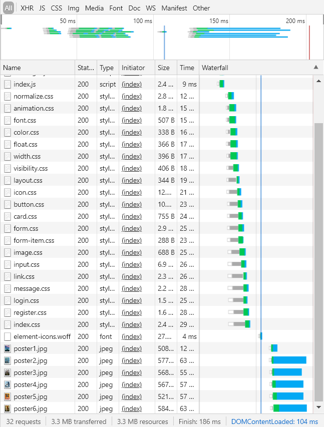

此时没有任何优化，图片直接使用``。

其实效果还行，但考虑到移动端用户通常情况下首屏不会显示所有图片，并且移动端用户往往比较看重流量，优化还是很有必要的。同时，这个可以作为基准，因为延迟加载图片后必然带来性能上的负担，目标是优化到和这个相近甚至是更好的性能。

事实上，添加延迟加载图片的逻辑后，首屏加载时间下降到351ms：

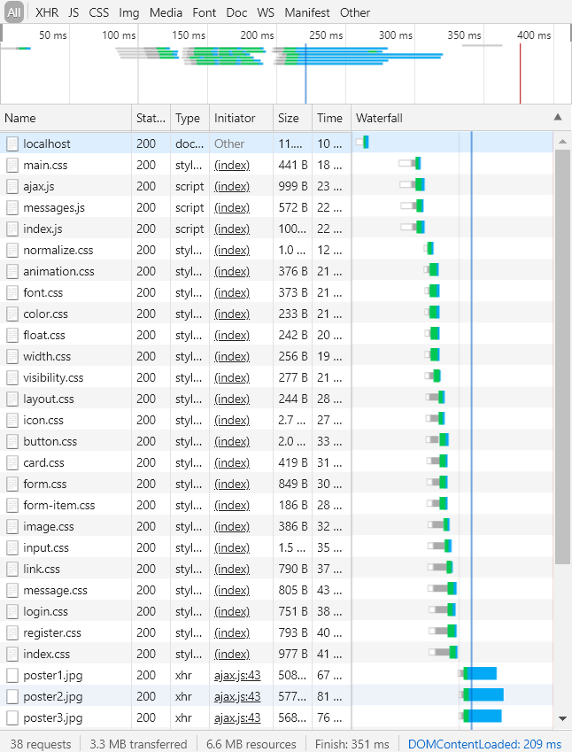

#### 优化方案

主要优化的几个点：

1. 传输过程中对静态资源进行压缩。
2. 按需引入CSS、JS。
3. 对CSS和JS进行uglify。
4. 对原始图片进行压缩。
5. 图片懒加载。
6. 对较小的静态文件进行合并。

下文进行详细解释。

#### 优化过程

##### 传输过程中进行压缩

本来想直接放到NGINX上的，后来想想算了，还是自己做比较好。用NGINX自带的gzip有点取巧的意思。这次主要利用Node原生的fs和zlib。

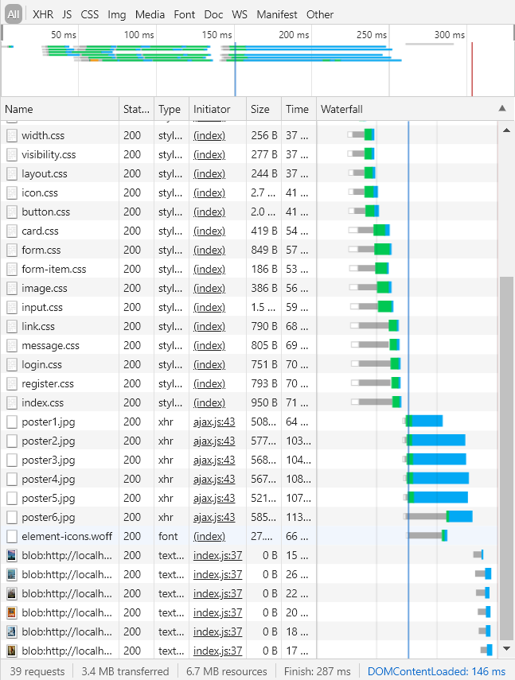

压缩后优化了60+ms。

##### 按需引入

减少对不需要的CSS、JS的依赖。用比较时髦的话来说，叫tree-shaking？

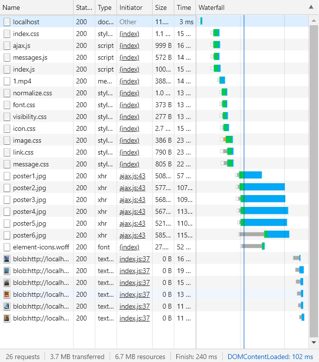

分析结构后，优化了接近50ms。

##### uglify

主要使用[UglifyJS 3](https://github.com/mishoo/UglifyJS2/)和[UglifyCSS](https://github.com/fmarcia/UglifyCSS)。uglify后的文件为`*.min.(js|css)`。

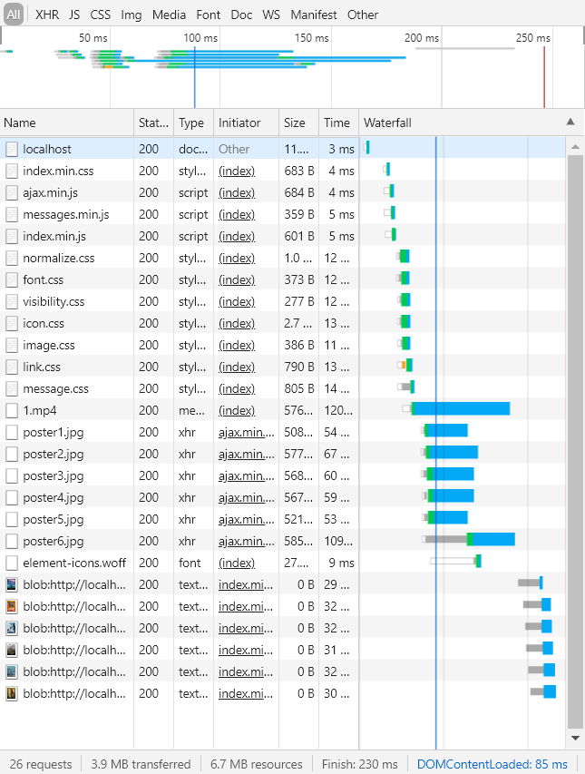

优化不是特别明显，只有大概10ms。但也是进步。但是我觉得效果不应该这么差……

##### 压缩原图片

参考网站https://tinypng.com/，官方也提供了相应的API。压缩率73%，总大小减少了2 MB。

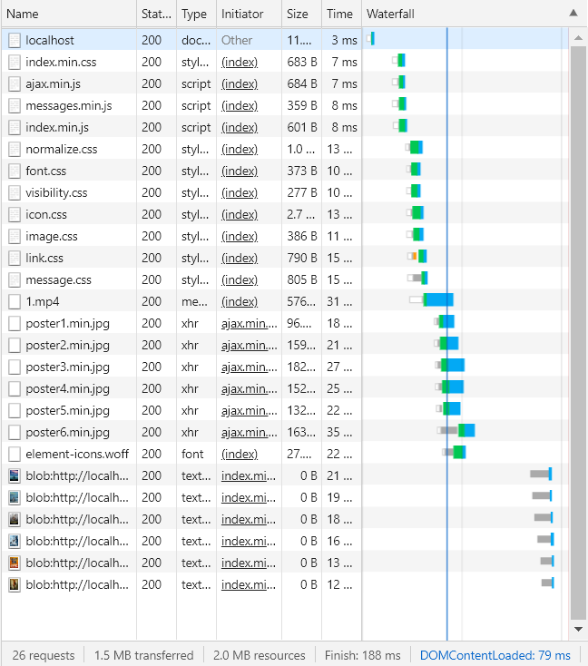

效果拔群，优化了将近50ms。

##### 懒加载

首先是使用了只能在Chrome上使用的`lazy`标签：

```html

```

不过这个标签兼容性很差，还是得用JS处理；基本思路就是等图片进入可视区域再开始加载。但是有一个需要注意的优化点，为了避免频繁触发滚动事件带来的性能问题，需要对滚动事件的回调函数进行防抖处理：

```js
window.addEventListener("scroll", debounce(function () {
    loadImages();
}, 100));
```

为了避免过大的性能负担，防抖时间暂定为100ms，可以视场景调整。

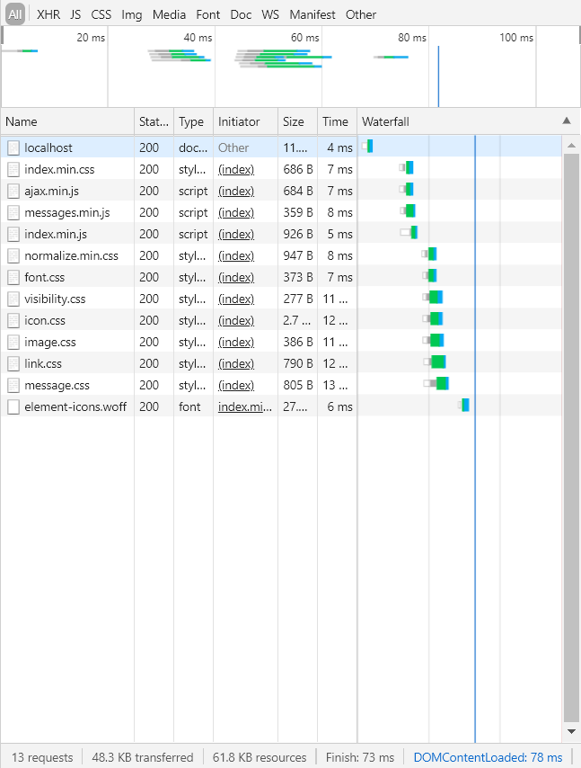

优化后首屏加载时间（在不加载图片的情况下）下降超过100ms，效果极其显著。

##### 合并较小的静态文件

> 2019.12.25补充。

通过合并较小的CSS，进一步减少请求次数，从而优化性能。

在这里是合并了index.js和index.css，然后压缩为*.min。

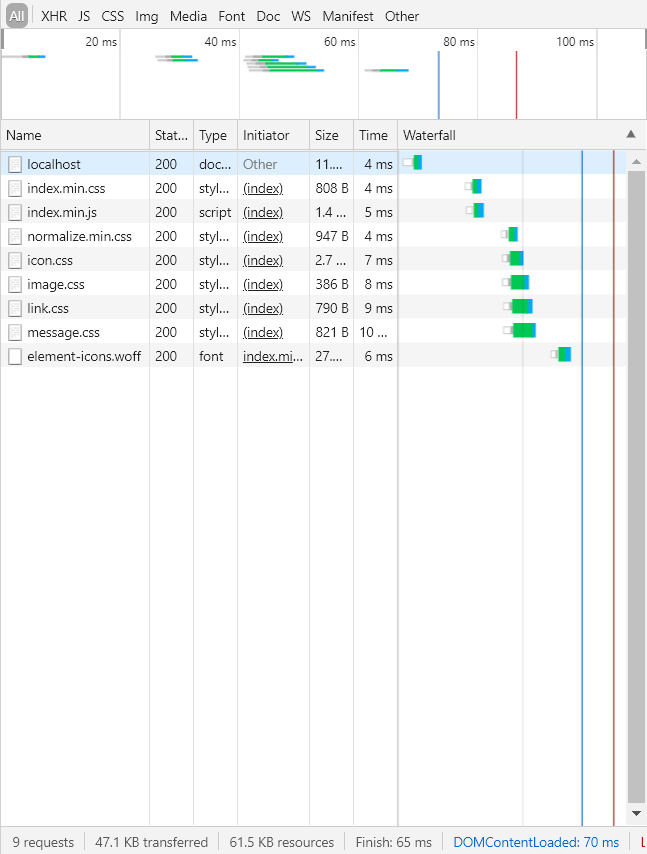

性能进一步提升，网络通信结束时间降低到了65ms。

同时，因为网络传输已经先于DOM加载完成，进一步优化的价值似乎不那么大了。

### 视频优化

虽然主要优化对象是图片，但是视频也是需要优化一下的。这次主要是采用分块传输，尽量减少每次网络通信的负担。思路无非就是每次发一定大小的块，参见`routes/index.js`。

至于为什么不懒加载视频，因为在这个场景下（电影），用户进入这个页面的主要目的就是看电影，基本不会存在用户不想看这个视频的情况，懒加载的意义不大。而且如果要懒加载，为什么不直接把video标签的preload设为none呢……

事实上，mp4格式并不完全适合在网页上播放，据说flv格式是最适合的。但是因为上课要求前端不要使用第三方库，所以暂且作罢。

### 低网速情况下的考虑

由于这个的场景是电影网站，一般也不会有人用3G乃至2G看电影吧……所以并没有针对低网速进行**特殊的**优化，比如进一步合并所有的CSS和JS。

因为在前期做的时候忘了截图，所以只有最后优化的结果……可以看到，优化之后的结果，即使是在slow 3G的网络环境下，也是可以接受的。

#### Fast 3G

事实上，在Fast 3G的网络环境下，合并小文件后的性能反而不如不合并。虽然说差别也不大吧……

##### 不合并

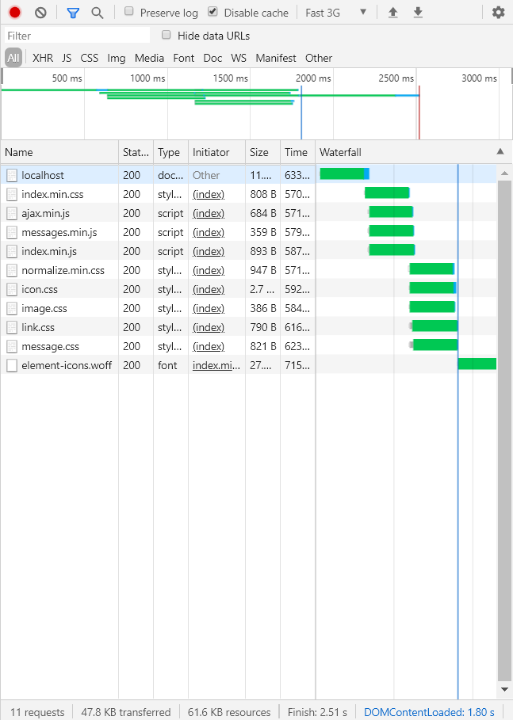

##### 合并

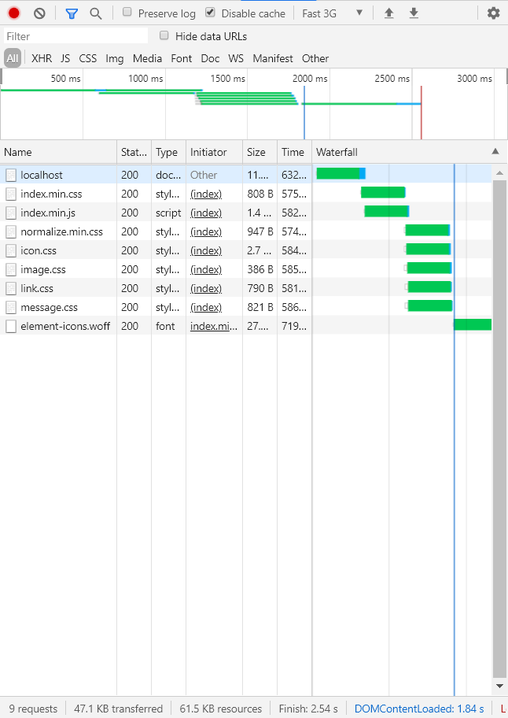

#### Slow 3G

但在Slow 3G的网络环境下，合并小文件后的性能是比不合并好的。可能之前是个例。

而且比较诡异的是，这里居然会有MP4文件的请求？

##### 合并

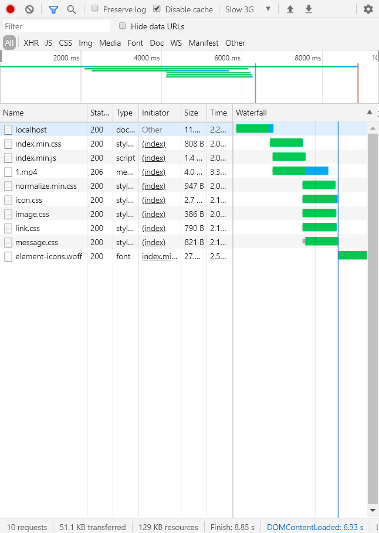

##### 不合并

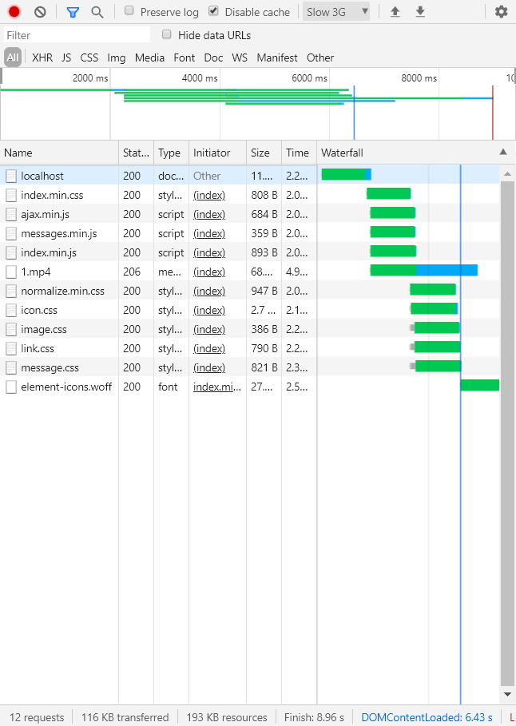
